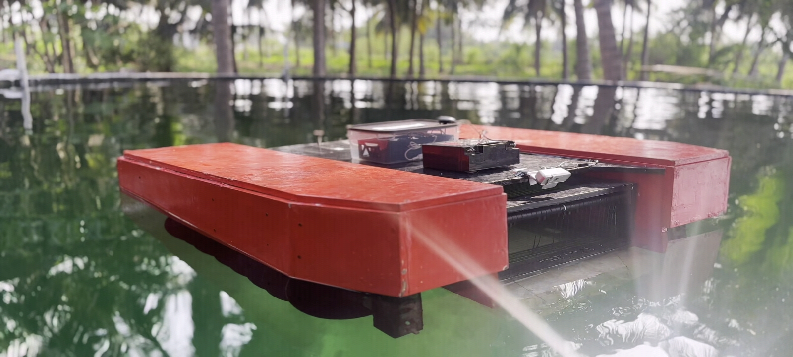

# 🚤 Autonomous Surface Rover

A amphibious **Autonomous Surface Rover** built to collect floating waste and monitor water surfaces. Designed for environmental cleanup and real-time inspection in lakes and rivers.

---

## 🌍 Social Impact

Aligned with key **UN SDGs**:
- **SDG 6:** Clean Water  
- **SDG 13:** Climate Action  
- **SDG 14:** Life Below Water  

> ♻️ A sustainable solution to combat water pollution.

---

## 🏆 Achievements

- 🥇 **Winners – Aquatic Cleaning Drone Challenge Hackathon, IITM-PALS**  
  Awarded ₹15,000 ($175)  
  Developed a surface rover to collect floating waste in polluted water bodies.

---

## ⚙️ Features

- 🛰️ Autonomous navigation  
- 🌊 Screw Propeller design  
- 🎥 Live video + waste detection  
- 🔋 Rechargeable power system  

---

## 📁 Repo Contents

- `Design_3D_Models.zip` – CAD files  
- `Documentation.zip` – Full project docs  
- `Testing_Video.zip` – Real-world test footage  
- `Presentation.zip` – Final pitch deck  

---

## 🛠️ Tools Used

- **Fusion 360** – CAD design  
- **Raspberry Pi 4** – Microcontroller  
- **GPS** – Navigation  
- **Python / Embedded C** – Control logic  
- **Git LFS** – Large file handling  

---

## 🙌 Acknowledgments

Thanks to our mentors and the IITM-PALS community for their guidance and support.

---
